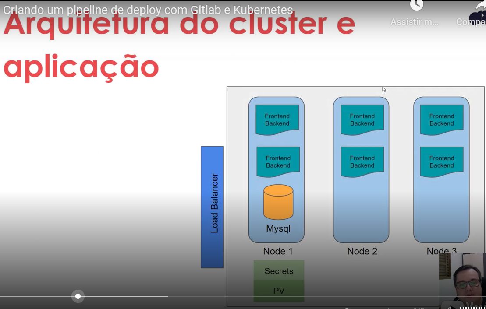

# Projeto 2: Criando um pipeline de deploy com Gitlab e Kubernetes

Nesse repositório estão contidos os códigos de um dos desafios ocorridos no curso de Linux, parte do Bootcamp **"Jornada DevOps com AWS - Impulso"**, organizada pelo portal [DIO](https://www.dio.me/), no período de outubro a dezembro de 2022. 

## Desafio
Neste projeto será criado um pipeline de deploy de uma aplicação com cenários de produção de imagens com Docker e criação dos deployments em um cluster kubernetes em nuvem utilizando o GCP.

### Código fonte da aplicação 

[denilsonbonatti](https://github.com/denilsonbonatti/k8s-projeto1-app-base)

### Arquitetura do Cluster e Aplicação

